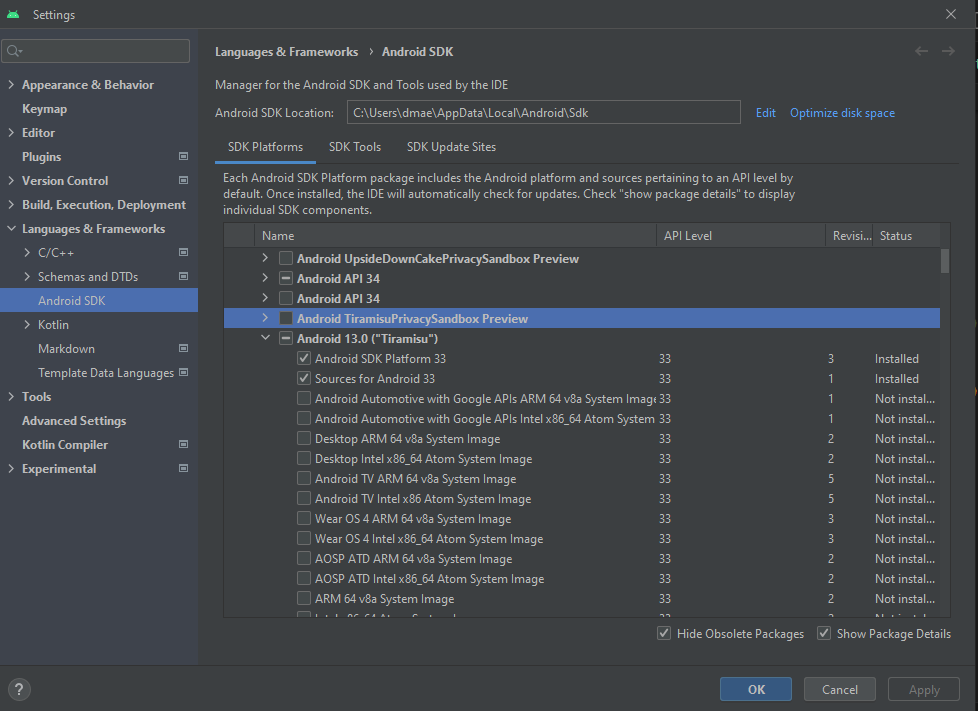
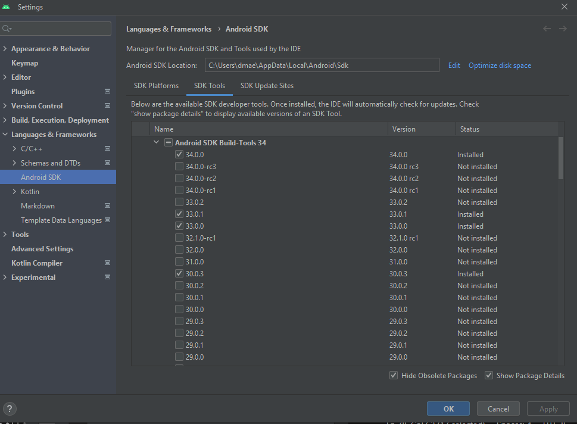
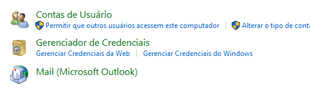
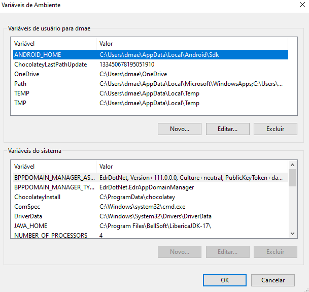
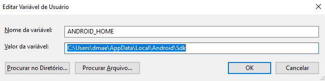
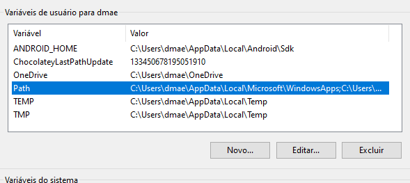
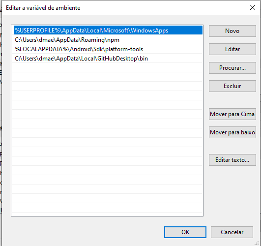

## Instalando Dependências
Você precisará do Node, da interface de linha de comando do React Native, de um JDK e do Android Studio.

Embora você possa usar qualquer editor de sua escolha para desenvolver seu aplicativo, será necessário instalar o Android Studio para configurar as ferramentas necessárias para construir seu aplicativo React Native para Android.

### Node, JDK

#### Node
É recomendado usar uma versão LTS do Node. Se você deseja alternar entre diferentes versões, pode querer instalar o Node via nvm-windows, um gerenciador de versões do Node para Windows.

1. **Baixe o Node.js:** Vá para [Node.js Download Page](https://nodejs.org/en/download/) e baixe a versão recomendada para Windows.
2. **Instale o Node.js:** Execute o instalador baixado e siga as instruções.
3. **Verifique a Instalação:** Abra o Prompt de Comando e digite `node -v` e `npm -v` para verificar se o Node.js e o npm foram instalados corretamente.

#### JDK

1. **Baixe o JDK:** Vá para [AdoptOpenJDK](https://adoptopenjdk.net/) e escolha a versão 17 JDK.
2. **Instale o JDK:** Execute o instalador e siga as instruções.
3. **Configurar Variáveis de Ambiente:** Adicione o caminho do JDK à variável de ambiente `PATH`.

Se você já instalou o Node em seu sistema, certifique-se de que seja o Node 18 ou mais recente. Se você já tem um JDK em seu sistema, recomendamos o JDK17. Você pode encontrar problemas ao usar versões mais altas do JDK.

Você pode encontrar opções adicionais de instalação na página de Downloads do Node.

### Ambiente de Desenvolvimento Android
Configurar seu ambiente de desenvolvimento pode ser um pouco tedioso se você é novo no desenvolvimento Android. Se você já está familiarizado com o desenvolvimento Android, há algumas coisas que você pode precisar configurar. Em qualquer caso, certifique-se de seguir cuidadosamente os próximos passos.

1. **Instalar o Android Studio**
   Baixe e instale o Android Studio. Durante o assistente de instalação do Android Studio, certifique-se de que as caixas ao lado de todos os seguintes itens estejam marcadas:

   - Android SDK
   - Android SDK Platform
   - Android Virtual Device
   - Se você não estiver usando o Hyper-V: Performance (Intel ® HAXM) (Veja aqui para AMD ou Hyper-V)

   Em seguida, clique em "Next" para instalar todos esses componentes.

   Se as caixas de seleção estiverem esmaecidas, você terá a chance de instalar esses componentes mais tarde.

   Uma vez que a configuração tenha finalizado e você estiver na tela de boas-vindas, prossiga para o próximo passo.

2. **Instalar o Android SDK**
   O Android Studio instala o Android SDK mais recente por padrão. No entanto, para construir um aplicativo React Native com código nativo, é necessário o Android SDK 13 (Tiramisu) em particular. SDKs Android adicionais podem ser instalados através do Gerenciador de SDK no Android Studio.

   Para fazer isso, abra o Android Studio, clique no botão "Mais Ações" e selecione "Gerenciador de SDK".

   O Gerenciador de SDK também pode ser encontrado no diálogo "Configurações" do Android Studio, em Idiomas & Frameworks → Android SDK.

   Selecione a aba "SDK Platforms" dentro do Gerenciador de SDK, depois marque a caixa ao lado de "Mostrar Detalhes do Pacote" no canto inferior direito. Procure e expanda a entrada do Android 13 (Tiramisu), então certifique-se de que os seguintes itens estejam marcados:

   - Android SDK Platform 33
   - Intel x86 Atom_64 System Image ou Google APIs Intel x86 Atom System Image

   

   Em seguida, selecione a aba "SDK Tools" e marque a caixa ao lado de "Mostrar Detalhes do Pacote" aqui também. Procure e expanda a entrada do Android SDK Build-Tools, depois certifique-se de que 33.0.0 esteja selecionado.

    

   Finalmente, clique em "Apply" para baixar e instalar o Android SDK e as ferramentas de build relacionadas.

3. **Configurar a Variável de Ambiente ANDROID_HOME**

   As ferramentas do React Native requerem que algumas variáveis de ambiente sejam configuradas para construir aplicativos com código nativo.

   Abra o Painel de Controle do Windows.
   Clique em Contas de Usuário, depois clique novamente em Contas de Usuário
   Clique em Alterar minhas variáveis de ambiente
   Clique em Novo...

   

   Para criar uma nova variável de usuário ANDROID_HOME que aponte para o caminho do seu Android SDK:

   

   Configurando

   

   

   O SDK é instalado, por padrão, no seguinte local:

   `%LOCALAPPDATA%\Android\Sdk`

   Você pode encontrar o local real do SDK no diálogo "Configurações" do Android Studio, em Idiomas & Frameworks → Android SDK.

   

   Abra uma nova janela do Prompt de Comando para garantir que a nova variável de ambiente seja carregada antes de prosseguir para o próximo passo.

   Abra o PowerShell

   Copie e cole `Get-ChildItem -Path Env:\` no PowerShell
   Verifique se ANDROID_HOME foi adicionado

4. **Adicionar platform-tools ao Path**

   Abra o Painel de Controle do Windows.
   Clique em Contas de Usuário, depois clique novamente em Contas de Usuário
   Clique em Alterar minhas variáveis de ambiente
   Selecione a variável Path.
   Clique em Editar.

   

   Clique em Novo e adicione o caminho para platform-tools à lista.
   O local padrão para esta pasta é:

   `%LOCALAPPDATA%\Android\Sdk\platform-tools`

   
